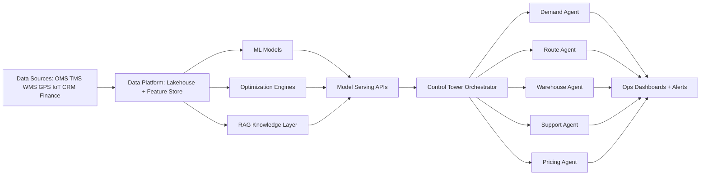

# AI Transformation Strategy for a Global Logistics Company

## 1) Business Problem Analysis

The current logistics operation has strong domain coverage but fragmented decision-making across demand planning, route planning, warehousing, support, and pricing. This causes avoidable cost leakages:

- Capacity mismatch (empty runs or overloaded hubs)
- Slow/manual planning cycles
- Reactive maintenance and exception handling
- Weak personalization in pricing and customer communication
- Emissions pressure with limited optimization governance

Target transformation outcome:

- Faster, data-driven operational decisions
- Lower cost-to-serve per parcel
- Better on-time delivery and first-attempt success
- Reduced fraud losses
- Measurable ESG improvements

## 2) End-to-End AI Architecture

Design principles:

- Event-driven ingestion (stream + batch)
- Shared feature definitions across teams
- Human-in-the-loop for high-risk decisions
- Guardrailed agent orchestration (policy + audit logs)

## 3) AI Solutions by Problem Statement

### 1. Demand Forecasting for Shipment Volume
- **Model**: Hierarchical time-series (LightGBM + calendar features), optionally Temporal Fusion Transformer for large scale.
- **Why**: Better interpretability and regional granularity than plain LSTM baseline.
- **Output**: Daily parcel volume by region + uncertainty intervals.
- **Key features**: Historical volume, promotions, holidays, weather anomalies, macro signals.

### 2. Intelligent Route Optimization
- **Model/Engine**: OR-Tools VRP solver + ETA model (XGBoost) + weather/traffic penalties.
- **Why**: Combinatorial optimization is best solved by VRP constraints; ML predicts travel time more accurately than static averages.
- **Output**: Optimal stop sequence, ETA, fuel estimate, route risk.

### 3. Warehouse Picking Optimization
- **Model/Engine**: Slotting demand predictor + shortest-path/bin-picking optimizer.
- **Why**: Hybrid of forecasting and operations research minimizes walking and congestion.
- **Output**: Picker sequence, zone heatmap, labor balancing recommendations.

### 4. Predictive Maintenance for Fleet Vehicles
- **Model**: XGBoost / Random Forest on telematics + DTC codes; survival model for remaining useful life.
- **Why**: Tree models handle mixed sensor/tabular data well and remain explainable.
- **Output**: Failure probability, severity, maintenance window recommendation.

### 5. Fraud Detection in Shipping Claims
- **Model**: Supervised classifier + anomaly detection (Isolation Forest / autoencoder).
- **Why**: Combines known fraud patterns with unknown/novel behavior detection.
- **Output**: Fraud score, reason codes, review routing.

### 6. AI-Powered Customer Service (RAG)
- **Model**: RAG pipeline (retriever + LLM), tool-calling for real-time tracking APIs.
- **Why**: Reduces hallucination versus raw LLM and grounds answers on company policy + shipment facts.
- **Output**: Answer, citation/confidence, escalation trigger.

### 7. Dynamic Pricing for Shipping
- **Model**: Price elasticity model + gradient boosting regressor + constrained optimization.
- **Why**: Captures demand sensitivity while enforcing margin and fairness guardrails.
- **Output**: Recommended price, confidence band, rationale.

### 8. Last-Mile Delivery Failure Prediction
- **Model**: CatBoost/XGBoost binary classifier.
- **Why**: Strong performance on tabular operational features and categorical contexts.
- **Output**: Failure probability pre-dispatch + intervention action.

### 9. Carbon Emission Optimization
- **Model/Engine**: Multi-objective optimizer (cost, SLA, CO2) + EV assignment policy model.
- **Why**: ESG requires explicit trade-off optimization, not single-metric routing.
- **Output**: Eco-route, emissions baseline vs optimized plan, EV utilization target.

### 10. Multi-Agent AI Control Tower (Agentic AI)
- **Framework**: LangGraph with stateful agent graph and policy nodes.
- **Why**: Deterministic orchestration, retries, shared memory, and tool governance for production-grade agent systems.
- **Output**: Coordinated decisions across demand, route, warehouse, support, pricing.

## 4) Dataset Requirements

Core data domains:

- **Demand**: region/day shipment history, seasonality, promotions, holiday calendars
- **Route**: stop geolocation, historical ETA, traffic/weather, fuel consumption
- **Warehouse**: SKU velocity, bin locations, picker logs, processing times
- **Fleet**: telematics, engine diagnostics, maintenance history
- **Claims**: claim type/value, evidence metadata, user behavior history
- **Customer support**: FAQ/policy docs, chat transcripts, tracking events
- **Pricing**: transaction history, conversion rates, competitor benchmarks
- **Delivery success**: first-attempt outcomes, address quality, customer availability
- **Carbon**: vehicle factors, distance, load factors, grid carbon intensity

Data quality controls:

- Feature contracts for schema drift
- Label quality checks
- Time-travel consistency in training/evaluation

## 5) Deployment Strategy

### Phase 1 (0-3 months): Foundation
- Build unified feature store and baseline APIs per use case
- Launch pilot for 2 regions (forecast + route + support RAG)
- Define MLOps and model governance standards

### Phase 2 (3-6 months): Scale
- Expand to all major hubs
- Deploy maintenance, fraud, dynamic pricing, delivery-failure models
- Add online monitoring (drift, latency, business KPI impact)

### Phase 3 (6-12 months): Agentic Control Tower
- Productionize LangGraph multi-agent orchestration
- Implement closed-loop optimization (decision -> outcome -> retraining)
- Add scenario simulation and executive control-tower dashboard

## 6) Risk, Governance, and Ethics

- **Bias/Fairness**: Prevent discriminatory pricing or service quality by geography/income proxies.
- **Explainability**: Keep auditable reason codes for maintenance, fraud, and pricing decisions.
- **Privacy**: Minimize PII in training, use role-based access and encryption.
- **Safety**: Human override for high-stakes actions (claim rejection, major route reallocations).
- **Hallucination control (RAG)**: citation requirement + confidence thresholds + escalation.
- **Agentic risk**: policy engine, tool access boundaries, and approval gates for autonomous actions.

## 7) ROI Estimation (Year-1 directional)

- Demand + route optimization: **8-15%** logistics cost reduction
- Warehouse picking optimization: **10-20%** labor productivity uplift
- Predictive maintenance: **15-25%** breakdown reduction
- Fraud detection: **20-35%** false-claim loss reduction
- RAG support: **25-40%** agent workload reduction
- Dynamic pricing: **2-6%** margin improvement
- Delivery failure prediction: **10-18%** reattempt reduction
- Carbon optimization: **8-20%** emissions reduction on optimized lanes

Estimated blended impact:

- **Cost-to-serve**: down **10-18%**
- **On-time performance**: up **4-9 pp**
- **Customer satisfaction (CSAT/NPS)**: up **5-12%**
- **Payback period**: typically **9-15 months** (depends on rollout speed and data maturity)

## 8) Prototype Scope (Bonus)

Recommended prototype stack:

- **Backend**: FastAPI endpoints per use case (already scaffolded)
- **Agent orchestration**: LangGraph workflow for 5 agents
- **UI**: Streamlit dashboard for scenario simulation and KPI tracking
- **RAG**: vector DB + policy/docs retriever + tracking API tool-call

Minimum demo storyline:

1. Forecast predicts shipment spike in Region A
2. Route engine and warehouse agent auto-adjust plans
3. Pricing agent applies guarded surge logic
4. Support bot sends proactive ETA communication
5. Control tower shows KPI delta and carbon impact

## 9) Current Code Status and Next Build Steps

Already present in codebase:

- 10 API modules mapped to the assignment problem statements
- Base FastAPI service wiring complete

Now upgraded:

- Typed request/response endpoints for all modules
- Heuristic decision logic to simulate model behavior
- Multi-agent control endpoint returning coordinated actions

Next steps to complete production track:

1. Replace heuristics with trained models and optimizer services.
2. Add feature store integration and model registry.
3. Add LangGraph runtime with tool policies and memory.
4. Add automated tests, monitoring, and CI/CD deployment.
